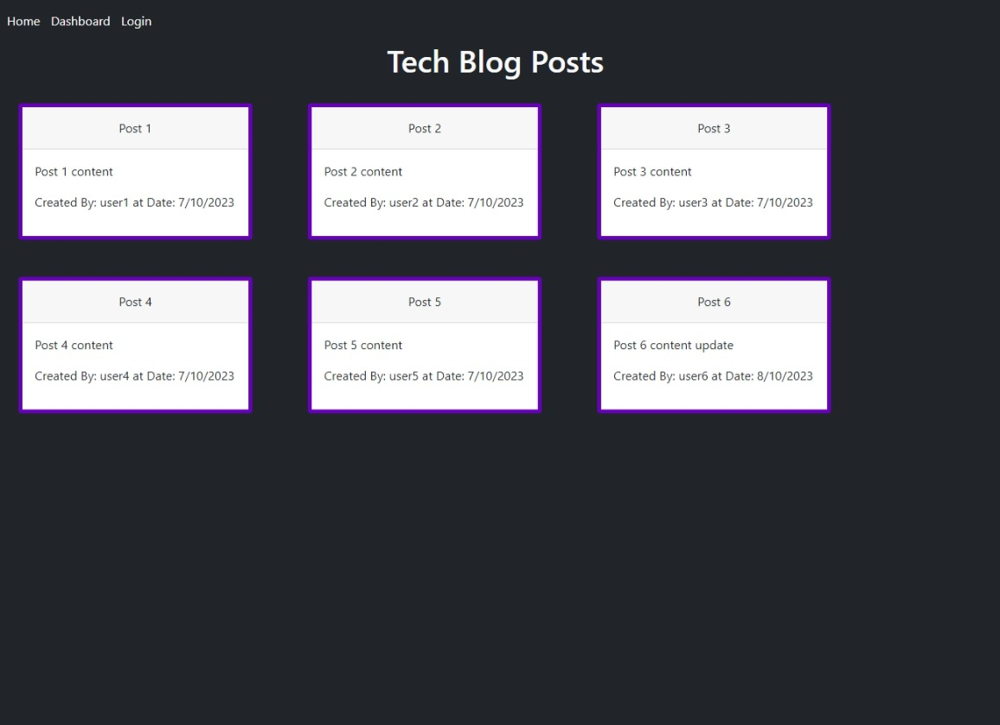
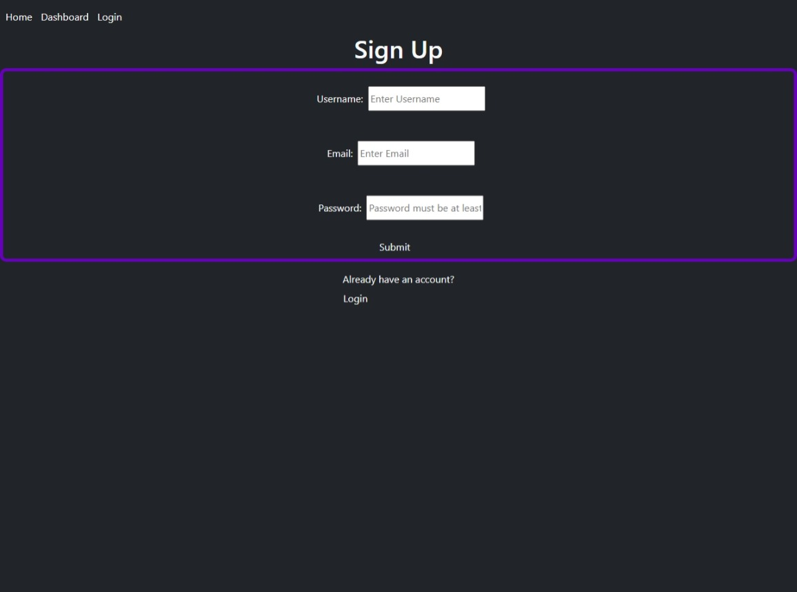
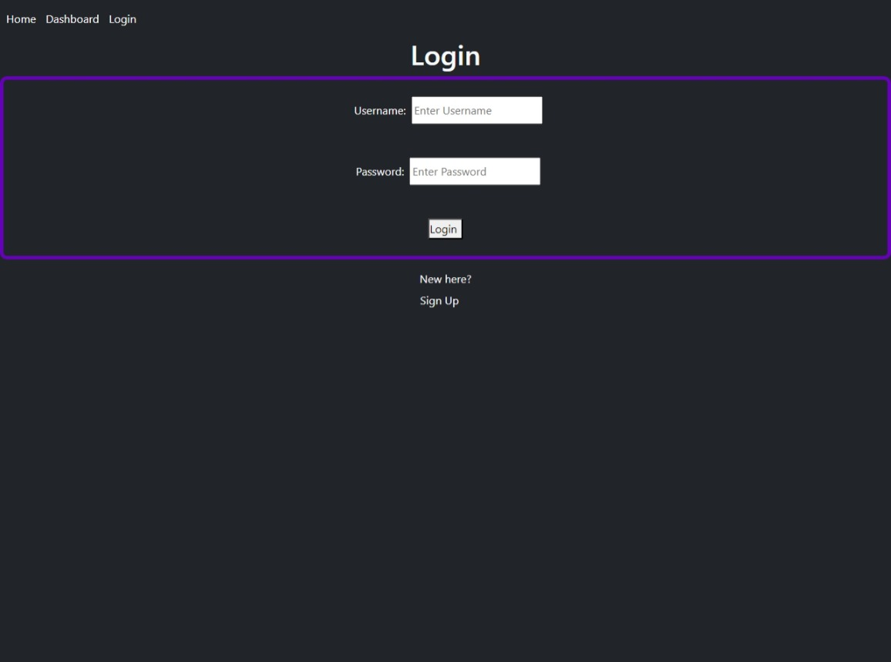
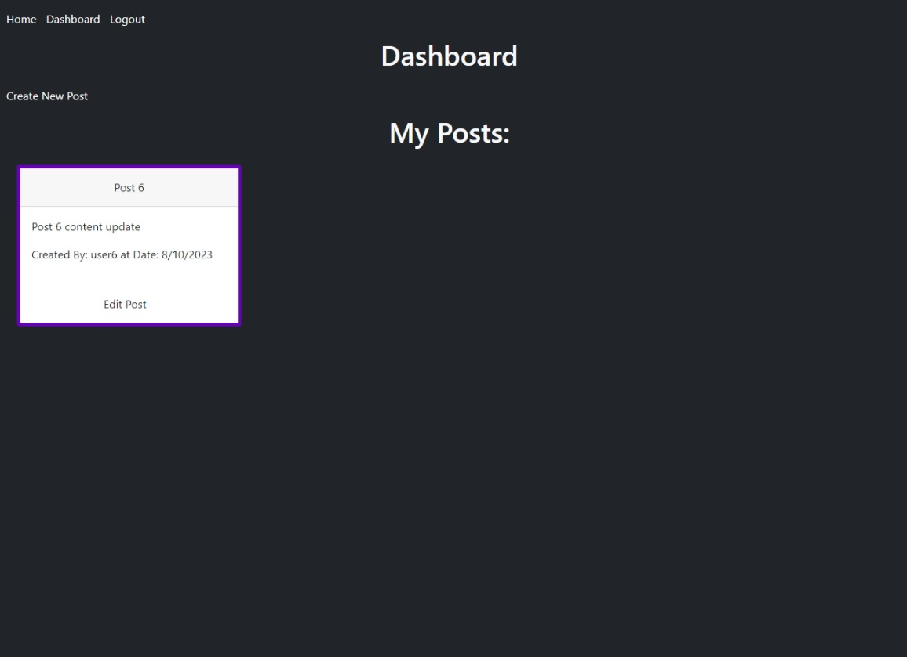
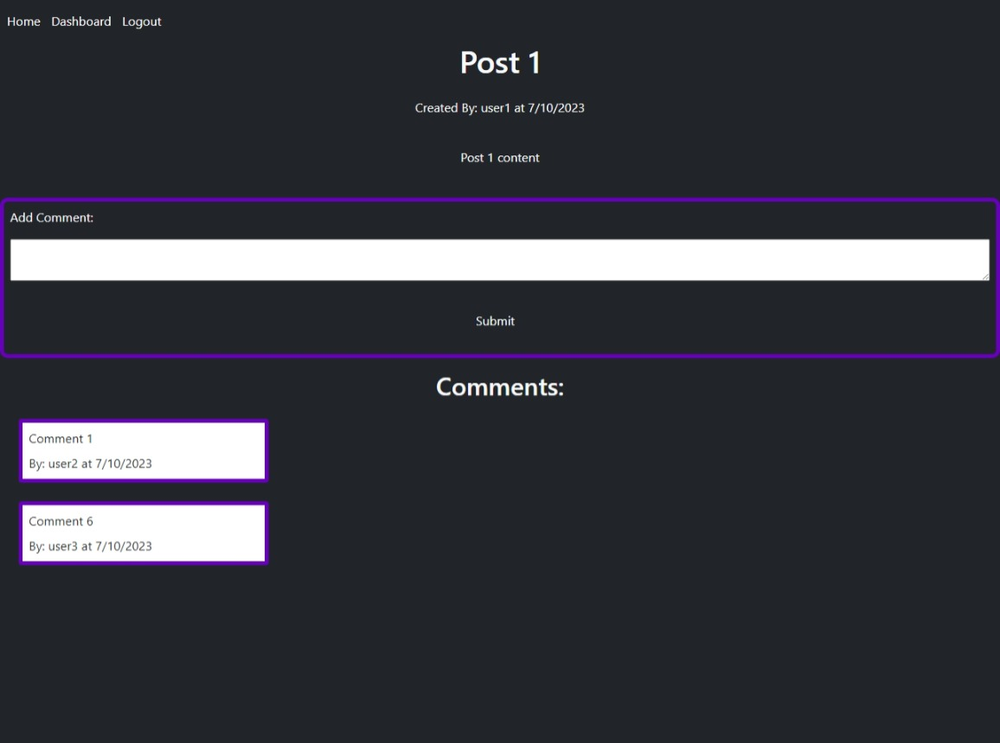
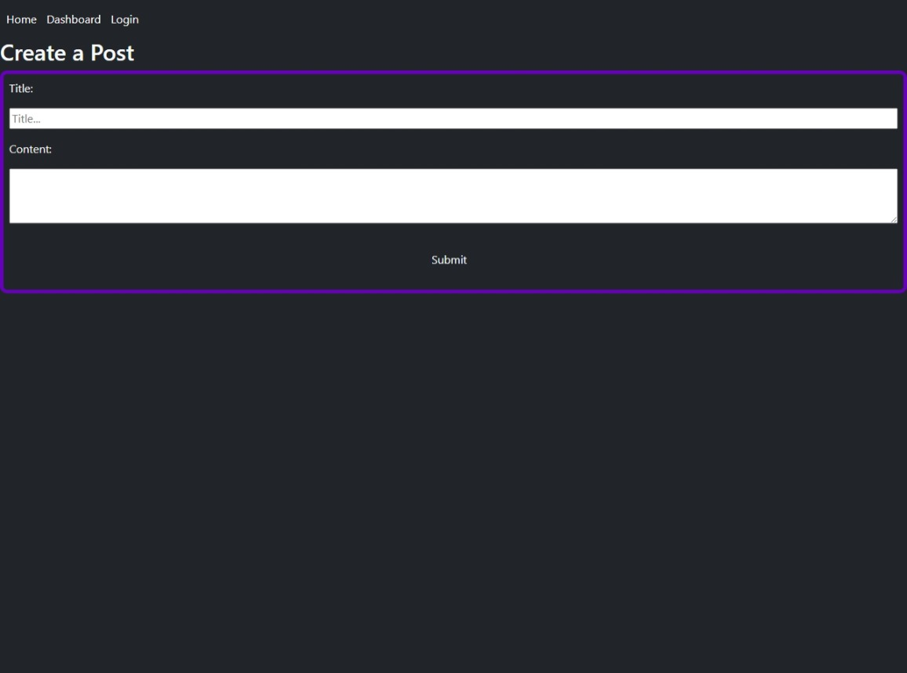

# tech-blog

## Table of Contents

[Description](#description)

[Installation](#installation)

[Usage](#usage)

[Images](#images)

[URLs](#urls)

## Description

This is a mock-up of what could be a blogging website. Users can create accounts, view others' posts, keep track of their own posts, and leave comments. From the dashboard, users can create, edit, or delete their own posts. When visiting others' posts, users can read all the comments left on that post, and leave a comment of their own.

## Installation

Clone the repository and run "npm install". 
Set up a .env file with SESSION_SECRET, DB_NAME, DB_USER, and DB_PASSWORD.
Use sql and run the db/schema.sql file.
Run "npm seed".
Finally, run the app with either "node server.js" or "npm start".

## Usage

There is a navigation menu at the top for users to go to the home page, their dashboard (if they are logged in) or to the login/signup page (if they are not logged in). Users who are logged in will see a logout button instead of the login button.

Signing up or logging in is as simple as filling in the form that is presented.

Creating new posts and comments is accomplished by filling in the new post or new comment forms on the appropriate pages.

Editing the posts is done simply through another form. This form displays the information that was there before so that it is easy to edit whichever parts the user wants.

## Images

Here are some images of the webpage:

Here is a video walkthrough:

## URLs

GitHub Repo: https://github.com/Shippo704/tech-blog

Deployed App: 

Walkthrough Video: https://drive.google.com/file/d/13MH2un6tm4R0933y5ZKTtiLTuIWz_Ua-/view